# Roadmap

Weeks are indicative and counted from kickoff. Phases overlap on purpose: while one wave is in cutover, the next wave's discovery and schema design are already under way.

```mermaid
gantt
    title Cloudant → PostgreSQL migration
    dateFormat  X
    axisFormat  W%s
    section Foundation
    Phase 0 · Discovery & inventory      :p0, 0, 3
    Phase 1 · Platform foundation        :p1, 2, 8
    section Migration waves
    Phase 2 · Pilot                      :p2, 8, 14
    Phase 3 · Wave 1                     :p3, 14, 22
    Phase 4 · Wave 2                     :p4, 20, 28
    Phase 5 · Wave 3                     :p5, 26, 34
    section Wrap-up
    Phase 6 · Decommission & optimize    :p6, 22, 40
```

## Phases

| Phase | Duration | Goal | Exit criteria |
|---|---|---|---|
| **0. Discovery & inventory** | 2–3 wks | Catalog every app's monthly DBs, doc shapes, views/indexes, `_changes` consumers, sizes, write rates and retention | Inventory complete; every app scored and assigned to a wave |
| **1. Platform foundation** | 4–6 wks | HA Postgres, PgBouncer, backups/PITR, monitoring, partition automation, shared migration toolkit, schema migrations in CI | Platform baseline issue complete on a non-prod cluster |
| **2. Pilot** | 4–6 wks | One medium-complexity app migrated end to end | Prod cutover done; runbook and toolkit updated with lessons learned |
| **3. Wave 1** | 6–8 wks | Low-risk, low-coupling apps | Cutover + 2 weeks stable; Cloudant read-only |
| **4. Wave 2** | 6–8 wks | Medium complexity, more downstream consumers | Same as Wave 1 |
| **5. Wave 3** | 6–8 wks | Critical / billing-path / highest-volume apps | Same as Wave 1, plus a full-scale load test and DR drill beforehand |
| **6. Decommission & optimize** | rolling, ~4 wks per app | Archive Cloudant to COS, delete DBs, remove dual-write code, cost review | Cloudant spend at zero; audit sign-off |

Each phase is a GitHub **milestone**, created by the bootstrap. App issues are assigned to their wave's milestone.

## Assigning apps to waves

Score each app from 1 (low) to 5 (high) on:

| Factor | What to look at |
|---|---|
| Data volume | Total size across monthly DBs; docs per month |
| Write rate | Peak writes/sec on the current month |
| Consumers | Number of `_changes` feeds and downstream readers |
| Criticality | Billing path? Customer-facing? |
| Query complexity | Number of views, reduce functions, search indexes |

Start with the lowest totals. Anything on the billing path goes into Wave 3, after the platform has proven itself in production. The pilot should be of medium complexity: hard enough to exercise the toolkit, but not business-critical.

## Rules for the whole programme

- **Keep a way back at every step**: Cloudant stays the source of truth until cutover, and stays read-only for 1–2 billing cycles afterwards.
- **Cut over at a month boundary**, so the previous month is closed and already verified.
- **Go/no-go is given by the DB guild**, based on the app issue's *Migration execution* and *Cutover readiness* sections.
- **Wave 3 cannot start** until the platform baseline's DR and restore-drill items are done.

See [GUIDELINES.md](GUIDELINES.md) for the technical playbook.
